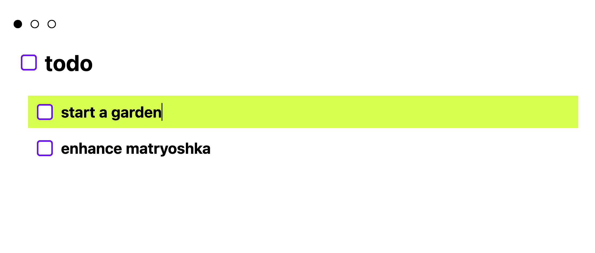

# 🪆 matryoshka

<a href="https://hunterirving.github.io/matryoshka/"></a><br>

turn mountains into molehills (then molehills into anthills) with <b>matryoshka</b>,<br>
the nested todo list that breaks complex tasks into manageable subtasks.

<i><b>try it now <a href="https://hunterirving.github.io/matryoshka/">in your browser</a> !</b></i> (physical keyboard required)

### key features
- unlimited subtask depth
- intuitive keyboard controls
- automatic saving using browser's local storage
- "single html file" architecture that works completely offline

### quickstart
1. press the `Return` / `Enter` key to add subtasks to the root "todo" task
2. give each new subtask a meaningful name
3. use `Shift + Arrow Right` to navigate into a subtask
4. use `Shift + Arrow Left` to return to the parent task
5. use `Shift + Enter` to quickly mark tasks as complete or incomplete

## controls

### navigation
- `Arrow Up/Down` move between tasks at the same level
- `Shift + Arrow Right` navigate into a subtask
- `Shift + Arrow Left` return to the enclosing parent task

### task management
- `Enter` add a new task
- `Arrow Down` (on last subtask) add a new task at the bottom of the list
- `Backspace` (when selected task's text is empty) remove the task and its subtasks
- `Shift + Enter` toggle selected task's completion status
- `Shift + Arrow Up/Down` reposition the selected task within its current level

### text editing
- `Left/Right` move text cursor within selected task
- `Command/Ctrl + C` copy the selected task's text (or highlighted substring)
- `Command/Ctrl + X` cut the selected task's text (or highlighted substring)
- `Command/Ctrl + V` paste text content from the clipboard
- `Command/Ctrl + Z` undo text edit
- `Command/Ctrl + Shift + Z` redo text edit

## data persistence
your task tree is automatically saved to your browser's local storage after each edit. this ensures your tasks will persist even if you close the browser or refresh the page.

**⚠️ warning:** clearing your browsing data may erase your saved tasks. to avoid losing progress, create a manual backup before clearing your browsing data:

- `Command/Ctrl + S` export tasks to .txt file
- `Command/Ctrl + O` import tasks from .txt file

## themes
press `F2` to cycle through available themes.

to create a new theme, add a CSS ruleset with the following structure to index.html:

```css
:root[data-theme="sunflower"] {
	--background: var(--pollen);
	--text: var(--loam);
	--highlight: var(--chlorophyll);
	--accent: var(--terracotta);
}
```

You can also use themes to set custom fonts, etc:

``` css
:root[data-theme="medieval"] {
	--background: var(--moss);
	--text: var(--goat-milk);
	--highlight: var(--burl);
	--accent: var(--flame);
	& input[type="text"] {
		font-family: MedievalSharp;
	}
}
```

You can store named colors in the `:root` selector at the top of the `<style>` tag:

```css
:root {
	--pollen: #f4a127;
	--loam: #5a352b;
	--chlorophyll: #5aa83b;
	--terracotta: #b15c2e;

	--wheat: #d2c3a3;
	--earth: #4a3c31;
	--pumpkin: #cb7c52;
	--tobacco: #7d6c55;

	--moss: #20302f;
	--goat-milk: #d8d3c9;
	--burl: #231f20;
	--flame: #c63728;

	.
	.
	.
}
```

## browser compatibility
this application is designed to run on modern web browsers with javascript enabled. mobile browsers are technically supported, but a physical keyboard is required (for now).

## privacy
all data is stored locally on your machine. no data is sent to or stored on any external servers.

## licenses
this project is licensed under the <a href="/LICENSE.txt">GNU General Public License v3.0</a>.

the Basteleur font by <a href="https://keussel.studio/">Keussel</a> (distributed by <a href="https://velvetyne.fr/">Velvetyne</a>) is licensed under the <a href="/resources/fonts/LICENSE (Basteleur Moonlight).txt">SIL Open Font License, version 1.1</a>.