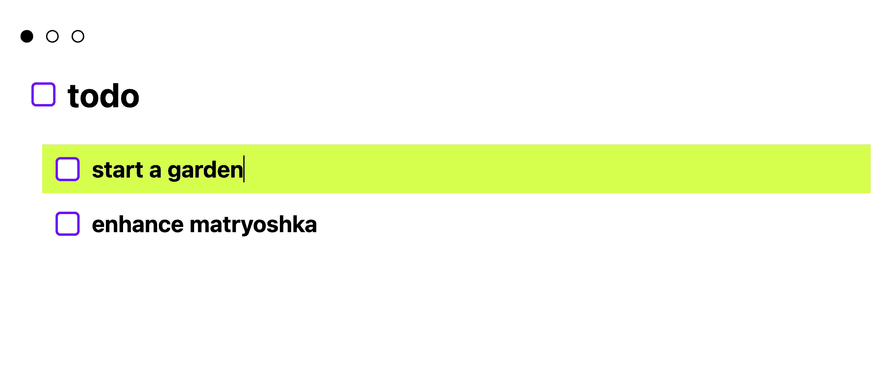

# 🪆 matryoshka

 

turn mountains into molehills (then molehills into anthills) with <b>matryoshka</b>, 
the nested todo list that breaks complex tasks into manageable subtasks.

<i><b>try it now <a href="https://hunterirving.github.io/matryoshka/">in your browser</a>!</b></i> (physical keyboard required).

### key features
- unlimited subtask depth
- intuitive keyboard controls
- automatically saves as you edit
- installable as a <a href="https://hunterirving.github.io/web_workshop/pages/pwa">Progressive Web App</a> that works completely offline

### quickstart
1. press the `Return` / `Enter` key to add subtasks to the root "todo" task
2. give each new subtask a meaningful name
3. use `Shift + ➡️` to navigate into a subtask
4. use `Shift + ⬅️` to return to the enclosing parent task
5. use `Shift + Enter` to quickly mark tasks as complete or incomplete

## controls

### navigation
- `⬆️/⬇️` move between tasks at the same level
- `Shift + ➡️` navigate into a subtask
- `Shift + ⬅️` return to the enclosing parent task

### task management
- `Enter` add a new task
- `⬇️` (on last subtask) add a new task at the bottom of the list
- `Backspace` (when task text is empty) delete selected task(s) and their subtasks
- `Shift + Enter` toggle selected task(s) completion status

### reorganization
- `Shift + ⬆️/⬇️` reposition selected task(s) within their current level
- `⌘ + ⬆️/⬇️` push selected task(s) into the task above or below
- `⌘ + ⬅️` pull selected task(s) out one level (to the level of their parent)
- hold `Shift` with any `⌘` command (push/pull) to simultaneously navigate to the task(s)' new position

### multi-select
- `Option + ⬆️/⬇️` extend or contract the selection to include adjacent tasks
- `⬆️/⬇️` (without modifier) clear the selection and resume single-task navigation

### text editing
- `⌘ + C` copy task text (or highlighted substring)
- `⌘ + X` cut task text (or highlighted substring)
- `⌘ + V` paste text from the clipboard

### theming
- press `F2` to cycle through available themes

## data persistence
your task tree is automatically saved to your browser's local storage after each edit. this ensures your tasks will persist even if you close the browser or refresh the page.

> [!WARNING]  
> clearing your browsing data may erase your saved tasks. to avoid losing progress, create a manual backup before clearing your browsing data.

- `⌘ + S` export tasks to .txt file
- `⌘ + O` import tasks from .txt file

## browser compatibility
matryoshka is designed to run on modern, desktop web browsers with javascript enabled. mobile browsers are technically supported, but a physical keyboard is required (for now).

## privacy
all data is stored locally on your machine. no data is sent to or stored on any external servers.

## licenses
this project is licensed under the <a href="LICENSE.txt">GNU General Public License v3.0</a>.

the <a href="https://velvetyne.fr/fonts/basteleur/">Basteleur</a> font by <a href="https://keussel.studio/">Keussel</a> (distributed by <a href="https://velvetyne.fr/">Velvetyne</a>) is licensed under the <a href="resources/fonts/LICENSE (Basteleur Moonlight).txt">SIL Open Font License, version 1.1</a>.
